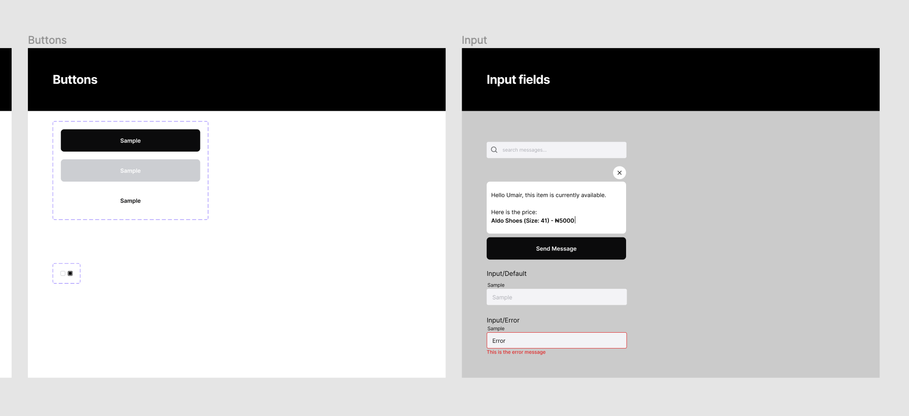
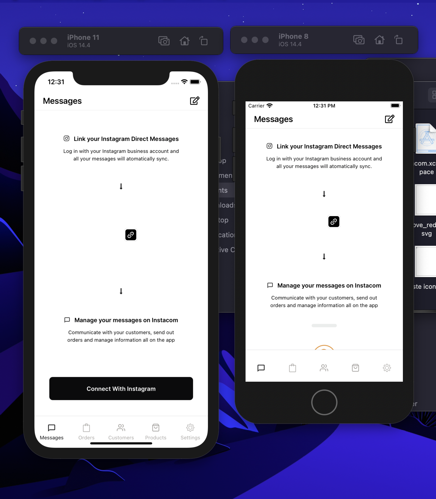
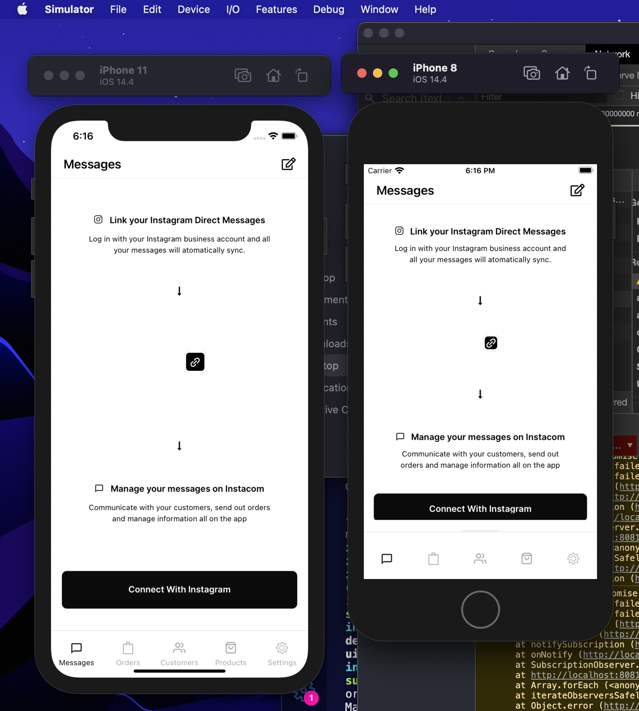
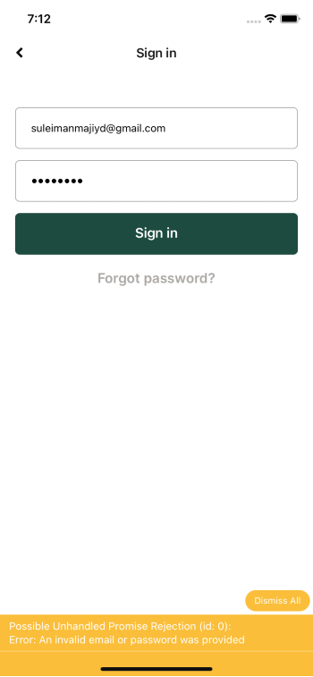

# Snapcart feedback

This is a feedback on the Snapcart app by Suleiman AbdulMajeed.

Before I start with the feedback proper, I'd like to take a moment to appreciate the designer. This is one of the best and most organized designs I have seen. I really love that a style guide section was provided. This would make it easy for developers to create fundamental components.



For the most part, most technical decisions are excellent and well made, however, I'll be making a few observations and recommendations on what could be done better.

I would split my observations and recommendations into 6 parts:

1. Keeping things DRY
2. Testing - (including pre commit hooks)
3. Scaling UI to fit across devices
4. Preferring svgs over images for icons
5. Best practice in terms of naming and using modern es2020 syntax
6. No visual feedback when I attempted to login with an invalid email.

## Keeping things DRY (Component Driven Development)

While going through the codebase, I noticed a lot of repetitive code and although the designer(s) had taken the time to create a style guide, the developers failed to implement fundamental atomic components. For example, I noticed a lot of occurrences of components like this, each receiving their own style.

```js
<TextInput
  style={styles.input}
  editable={!loading}
  placeholder="Email address"
  autoCapitalize="none"
  autoCorrect={false}
  value={formState.email}
  onChangeText={(text) => setFormState({ ...formState, email: text })}
/>

...

<TouchableOpacity onPress={onSave} style={styles.saveButton}>
  <Text style={styles.buttonText}>Save</Text>
</TouchableOpacity>
```

For the sake of consistency of components look and feel, as well as to adhere to modern component driven development techniques, I would recommend the creation of some basic components such that would match the style guide and can be easily reused elsewhere.

```js
export const TextInput = ({
  editable,
  placeholder,
  value,
  onChangeText,
  ...rest
}) => {
  return (
    <TextInput
      style={styles.input}
      editable={editable}
      placeholder={placeholder}
      value={value}
      onChangeText={onChangeText}
      {...rest}
    />
  );
};

export const Button = ({ title, secondary, onPress, style, ...rest }) => {
  return (
    <TouchableOpacity
      onPress={onPress}
      {...rest}
      style={[
        styles.button,
        { backgroundColor: secondary ? Colors.Black : Colors.White },
        style, // additional styles can be passed where necessary
      ]}
    >
      <Text style={styles.buttonText}>{title}</Text>
    </TouchableOpacity>
  );
};

// here styles is declared. This must match the styleGuide
```

In the block above, notice the `Colors` object. This is also an essential part of DRY principles. It is important that all colors come from a single source. All these ensure consistency of look and feel and also makes it easy to make app wide UI changes.

These fundamental components can now be imported elsewhere and used like so:

```js
import { Button } from "~/components";

<Button onPress={onSave} title="Save" />;
```

Another instance of repetitive code is in `AuthStack` where most of the components have the following lines of code

```js
headerBackImage: () => (
  <Icon
    name="chevron-left"
    size={15}
    color="#0D0D0D"
    style={{ marginLeft: 20 }}
  />
),
headerBackTitleVisible: false,
headerStyle: {
  shadowColor: 'transparent'
}
```

This repetition can be prevented by moving the props above to `screenOptions` of the parent navigator stack.

```js
<Stack.Navigator
  initialRouteName="Home"
  screenOptions={{
    headerBackTitleVisible: false,
    headerStyle: {
      shadowColor: "transparent",
    },
    headerBackImage: () => (
      <Icon
        name="chevron-left"
        size={15}
        color="#0D0D0D"
        style={{ marginLeft: 20 }}
      />
    ),
  }}
>
  {/* navigators */}
</Stack.Navigator>
```

With this, each navigator moves from

```js
<Stack.Screen
  name="Login"
  options={{
    title: "Sign in",
    headerBackImage: () => (
      <Icon
        name="chevron-left"
        size={15}
        color="#0D0D0D"
        style={{ marginLeft: 20 }}
      />
    ),
    headerBackTitleVisible: false,
    headerStyle: {
      shadowColor: "transparent",
    },
  }}
  children={(props) => <Login {...props} setToken={setToken} />}
/>
```

to

```js
<Stack.Screen
  name="Login"
  options={{
    title: "Sign in",
  }}
  children={(props) => <Login {...props} setToken={setToken} />}
/>
```

This is cleaner, more readable and also provides the extra advantage that all screen headers can be edited and updated from a single location.

## Testing

There's currently no tests on this project. I cannot stress the importance of testing enough. It is essential for catching bugs early and ensuring that updates don't break existing code.

For this purpose, I would recommend

- [Jest](https://jestjs.io/) for unit testing
- [React-native-testing-library](https://github.com/callstack/react-native-testing-library) for component testing and
- [Detox](https://github.com/wix/Detox) for end-to-end testing

I also recommend using [husky](https://github.com/typicode/husky) to set up pre-commit hooks. This would be used to enforce testing and linting before every commit.

## Scaling UI

React native create components as density independent pixels. This means that designs that are perfect on one device might look odd on other devices. In order to have a similar look and feel, it is essential to scale components across devices.



This can be done with a simple util function

```js
import { Dimensions } from "react-native";

const { width, height } = Dimensions.get("window");

export const scaleY = (value) => (value * height) / 812;

export const scaleX = (value) => (value * width) / 375;
```

This would be used like so

```js
  container: {
    flex: 1,
    paddingVertical: scaleY(20),
    paddingHorizontal: scaleX(20),
    alignItems: "center",
    justifyContent: "flex-start",
  },
  closeButton: {
    height: scaleY(10),
    width: scaleX(100),
    borderRadius: 6,
    backgroundColor: "#ABA8A5",
  },
```



Alternative methods include using flex layouts and setting dimensions as percentages

## Preferring SVGs over images

I noticed that on some branches icons are images. I would suggest that SVGs be prefered for implementing icons and placeholders over regular images because it scales nicely over various screen sizes without losing quality. They are relatively smaller in size compared to PNGs. They also render faster than images and provide an extra benefit of being easily editable. I would recommend [react-native-vector-icons](https://github.com/oblador/react-native-vector-icons) or [react-native-svg](https://www.npmjs.com/package/react-native-svg) if the icon you require is not available on react-native-vector-icons

## Modern best practices and coding standard

This one isn't necessarily a big deal but it makes sense to stick to best practices and coding standards. I noticed that component files are named in format `'/screens/OnBoarding/Connect/connect'`. if we follow best practices this would be `'/screens/OnBoarding/Connect/index'`.

Thus, the file can be imported elsewhere like so

```js
// good
import Connect from "../../screens/OnBoarding/Connect";

// as opposed to

//bad
import Connect from "../../screens/OnBoarding/Connect/connect";
```

I also noticed a couple of blocks where modern ES2020 syntax would have made the blocks look cleaner. An Example is:

```js
if (data) {
  if (data.initiatePasswordReset) {
    navigation.navigate("VerifyOTP", { email });
  }
}
```

Optional Chaining can be used to make this block cleaner like so:

```js
if (data?.initiatePasswordReset) {
  navigation.navigate("VerifyOTP", { email });
}
```

Finally, I noticed I didn't get visual feedback when my login failed. I couldn't tell if that's because the project is still in active development or an oversight.



Thank you for taking the time to go through this report, I look forward to a positive response from you.
